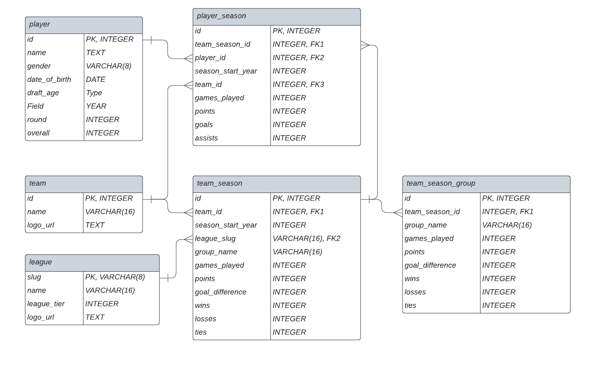

# pareto-hockey-populate

Toolkit for friends in 'Pareto Hockey' project to populate database of NHL career data from EliteProspects API.

## Intro

EliteProspects is an online data aggregation and visualization service for NHL prospect and career data. 

They provide a public-facing API with several endpoints to access and download this data for personal use which can be found [here](https://app.swaggerhub.com/apis-docs/esmg/Eliteprospects/1.0).

However, performing certain big aggregations over their dataset can prove awkward and time-consuming. Many endpoints return redundant information and it's difficult to aggregate over the specific ways we are looking for.

So to perform analysis, we temporarily cache the data in a local database (so we can query using SQL). pareto-hockey-populate creates and populates the local cache of needed relevant data.

## Usage

(Incomplete, not ready for general use)

## Database

**league**: an instance of a hockey league (ie: NHL, WHL, etc)

**team**: an instance of a hockey team (ie: the Canucks, the u17 Slovakian all-stars, etc).

**team-season-group**: an instance of a certain team's performance statistics over a given season, within a group, within a league. (Groups might include any arbitrary subgrouping of games within a season, such as bracket vs. finals, or pool play vs. bracket, etc)

**team-season**: an instance of a certain team's performance statistics ovver a given season, for a certain team, within a league. This is an aggregation (sum) of all statistics over the groups (player-season-groups) connected to this player-season. For example, if group 1 and 2 have 12 and 13 games_played, respectively, the connecting player-season will have 25 games_played.

**player**: a stored player and their personal information, and draft information if applicable (ie: Wayne Gretzky).

**player-season**: an instance of a certain players performance statistics within a team-season (for each player that composes that team-season)

